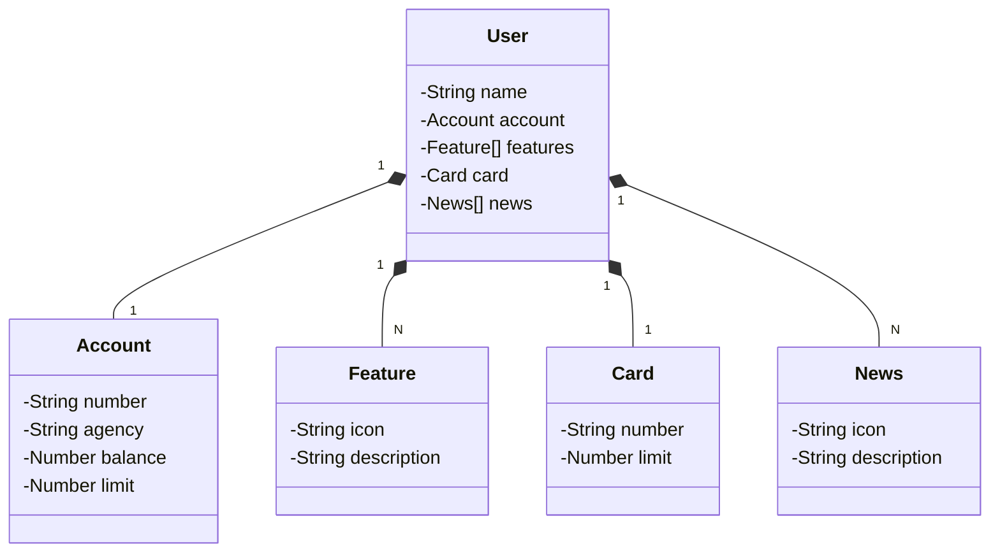

# Java Gradle API

Java API padrão Rest com deploy em serviço de nuvem.

Desafio de código final do bootcamp Backend Java feito pela Dio/Santander.

---------------
### Tecnologias utilizadas:

- Spring boot 3
- Spring initializer
- Gradle
- OpenAPI Documentation (antigo Swagger)
- JPA
- H2 database
- Railway com PostgreSQL

-----------------
### Abstração no Figma: [Link](https://www.figma.com/file/tlqteif6Y4BIpxypnP64qx/DIO%2FSantander-Bank-API-project?type=design&node-id=2%3A92&mode=design&t=PtF9ZvLtrzGFbhNF-1)

---------------------

### Diagrama de Classes (com Mermaid):

